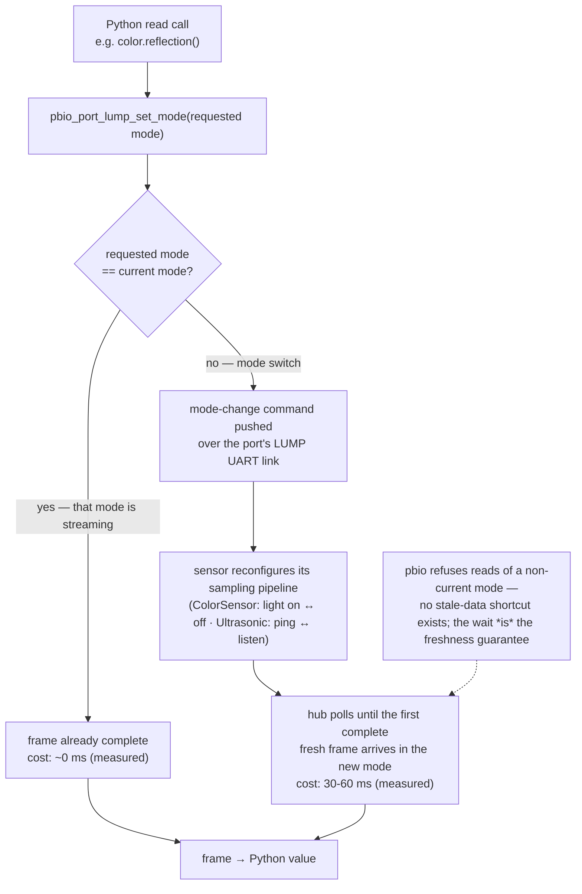
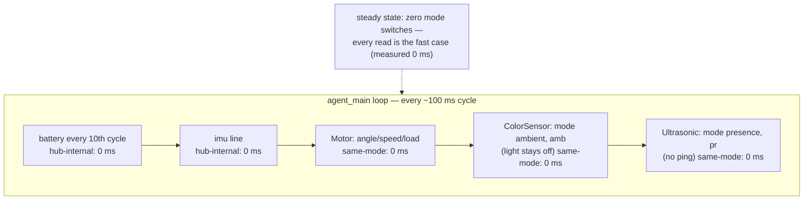

## D9 — The idle agent is passive: telemetry observes, never actuates

**Status:** accepted (2026-10-02, issue #15); rewritten in place 2026-10-02 — replaces the per-field freshness-split design recorded earlier the same day; neither version merged before this rewrite, so no shipped behavior ever depended on the old text.

**Context:** The D7 wire contract requires `port` lines emitted unconditionally per ~10 Hz cycle. Issue #15's first soak (2026-10-02, Motor on A, ColorSensor on C, UltrasonicSensor on E) measured the cycle at ~238 ms (4.2 Hz), and a per-op timing diagnostic isolated the cost entirely in PUP **mode switches**: every read on a non-current mode blocks ~30–60 ms. Per read-pair, measured: ColorSensor `ambient()` 34 ms + the next RGB_I read back 33 ms; UltrasonicSensor `distance()` 57 ms + `presence()` 52 ms; same-mode reads — motor, battery, imu, the empty-port probe — measured 0 ms. The first response to this data was a per-field freshness split (active fields cached, refreshed on a staggered ~1 s cadence). The owner's review rejected that treatment of the ColorSensor as a mere latency problem: its mode switch toggles the sensor's **visible light** — the idle robot would blink at the desk once per second.

**Mechanism** *(why a cross-mode read costs 30–60 ms, from the v4.0.1 pbio source)*: a PUP sensor is a small microcontroller connected to the hub over a LEGO UART (LUMP) link. At any moment the device is configured for exactly **one mode** and continuously streams data frames for that mode. Every Python read method (`pb_type_device_method_call`, `pybricks/common/pb_type_device.c`) first calls `pbio_port_lump_set_mode(requested)` — a no-op that returns success when the requested mode is already the current one (`port_lump.c`) — then waits for the current frame to be complete. A same-mode read finds data already streaming and returns in ~0 ms; a cross-mode read must push a mode-change command over the UART, and the device reconfigures its sampling pipeline before the first complete fresh frame in the new mode arrives — measured 30–60 ms of polling `pbio_port_lump_is_ready()`. There is no stale-read shortcut: `pbio_port_lump_get_data()` refuses data for a non-current mode, so the wait is also what *guarantees* freshness in the requested mode. The mode is a physical operating configuration, not just a data selector — ColorSensor's RGB_I keeps its light **on** (surface reflection) while SHSV keeps it **off** (ambient light); UltrasonicSensor's DISTL actively pings for distance while LISTN passively listens for *other* sensors' pings (presence).

**From latency to principle.** The freshness split treated the mode switch as a cost to amortize. The owner's reframe treats it as evidence of category error: illuminating a surface and pinging a room are **actuation**, not observation. The distinction this decision rests on: **telemetry as a capability is not intrinsically passive — the idle agent is.** A user program driving its sensors legitimately publishes their active readings (PROGRAM mode, R5 opt-in, the M2 surface — issue #36); an idle agent reporting on a robot nobody is driving must not actuate anything to have something to report. Three facts settle it:

1. **What the idle agent is for.** The agent-mode dashboard shows a robot nobody is driving. An idle robot should sit dark and quiet; a sensor light that blinks at the desk once a second is a product defect, whatever the cadence. And the dashboard's surface-color and distance readings of an idle robot are dishonest values — nothing asked to measure them.
2. **Who is entitled to actuate.** The BRD's mode model (architecture §2.2, R5) already gives that role to user programs: in PROGRAM mode the program owns the hub, and full telemetry persists only if it opts in by `import`-ing the library. A line-follower illuminating its own sensor is the legitimate publisher of `refl`/`col`. Pybricks runs one program at a time and the state model stops the agent before a user program starts, so the agent never contends for modes anyway — the principle stands on behavior and honesty, not interference.
3. **The passive subset is the fast subset.** Every field the idle agent keeps is a same-mode, 0 ms read (measured); every expensive field is an active one. The lean design deletes the entire refresh machinery — no caches, no refresh cadence, no stagger — instead of tuning it.

**Decision:**

*Principle.* The idle agent is a **passive guest**: it observes what the sensors' resting modes already stream, and never actuates — no illumination, no ping, no exceptions. Actuation, and the telemetry that reports it, belong to user programs in PROGRAM mode.

*Resting modes.* Every device rests in its passive mode; the agent reads only what that mode streams (fields as D7 defines them):

| Device | Resting mode (steady state) | Agent-mode fields | Active fields — owned by user programs (M2 opt-in, #36), never read by the agent |
|---|---|---|---|
| Motor | combined frame | `angle`, `speed`, `load` | — (all passive) |
| ColorSensor | SHSV, light **off** | `"mode":"ambient"`, `amb` | `"mode":"surface"`, `refl`/`h`/`s`/`v`/`col` (RGB_I, light on) |
| UltrasonicSensor | LISTN, transmitter **off** | `"mode":"presence"`, `pr` | `"mode":"distance"`, `d` (DISTL ping) |
| ForceSensor | FRAW | `f`, `d`, `pressed` | — (all passive) |
| TiltSensor | ANGLE | `pitch`, `roll` | — (all passive) |
| ColorDistanceSensor | AMBI | `"mode":"ambient"`, `amb` | `d` (PROX), `refl`/`h`/`s`/`v`/`col` (RGB_I) |
| InfraredSensor | — **not probed** | none | `d` (single mode; the sensor is an active IR emitter — LEGO-documented, 7 kHz pulsed — with no passive mode, so the idle agent neither detects nor reads it; it stays in the wire dictionary for M2 programs) |

*Reading-mode tags.* Mode-dependent sensor lines carry a `"mode"` key asserting which reading the values belong to (ColorSensor `"ambient"`/`"surface"`; UltrasonicSensor `"presence"`/`"distance"`); single-mode devices carry no tag. The publisher asserts the tag because it must: the LUMP driver tracks the current mode hub-side, but v4.0.1's Python API cannot read it (source-verified — `PUPDevice.info()` fetches `current_mode` and drops it), so the one who drives the sensor is the only one who can declare what was read. This makes the wire self-describing across the two regimes: the same ColorSensor device string carries `{"mode":"ambient","amb":12}` from the idle agent and `{"mode":"surface","refl":34,...}` from a program.

*Library/wrapper split.* `agent/brick_telemetry.py` is **passive mechanism only**: the pct curve, the canonical line builders, the passive field fragments, and the discovery probe — import-safe, no `run()`, no loop, no active reads. It exists to be imported: the M2 seam (R5, #36) is a user program building its own telemetry from the same primitives. `agent/agent_main.py` is **the console's agent**: it owns the ~10 Hz loop, the battery cadence, the park-at-attach policy, the detach `none` transitions, and discovery. Policy lives in the wrapper so the library can serve any program.

*Attach-time identification.* Discovery keeps the typed construct-ladder (the documented probe shape — `OSError(ENODEV)` on empty or wrong ports). The ColorSensor constructor performs one blocking RGB_I read at attach (verified in the v4.0.1 source): a single ~60 ms illumination at discovery, before the agent's first line — accepted as the one non-steady-state actuation (identification, not telemetry). The UltrasonicSensor and ColorDistanceSensor constructors are verified clean (no read at attach). A generic id-first probe exists (`PUPDevice(port).info()` returns the device id without selecting a mode); adopt it if invisible-IR ports or zero-illumination attach ever matter — not worth the hub-side RAM today.

*Schema.* Agent-mode `port` lines carry the passive subset only, e.g. `{"t":"port","p":"C","dev":"ColorSensor","mode":"ambient","amb":12}` and `{"t":"port","p":"E","dev":"UltrasonicSensor","mode":"presence","pr":false}`. The active fields stay in the D7 dictionary — PROGRAM-mode programs publish them — so fields validate per the declared `(device, mode)` pair: the parser accepts a tagged line's exact field set and nothing more, making it stricter, not looser; unknown pairs pass through like unknown `dev` strings. This is the first field-dictionary change, which triggers D7's evolution note: the dictionary content moves to `docs/specs/telemetry-wire.md`; D7 remains the decision record.

**Consequences:** The 10 Hz cadence holds with the full kit attached and zero steady-state mode switches (the freshness split would have amortized ~18 ms/cycle; this design pays 0 ms — simpler and faster, and it deletes a whole subsystem of constants, offsets, and cache-seeding). The idle robot is dark and silent after discovery's single ColorSensor blip — which makes "light off in steady state" a human-verifiable soak criterion. `pr` on a single-sensor desk is almost always `false` (presence means *another* ultrasonic heard) — honest dullness; `amb` (room light) is the live value on the color card. Surface color and distance appear on the dashboard exactly when a program runs and publishes them (M2, R5, #36) — actuation and its telemetry arrive together, which is the correct product story. The parser, store, and gateway need only the per-(device, mode) validation change; the dashboard's agent-mode cards (ambient/presence) ride #14. The principle is executable: host tests gain an actuation ban (stub call-counting asserts the agent never calls `reflection()`/`hsv()`/`color()` on a color sensor or `distance()` on an ultrasonic). On-hub re-verification, next hardware session: ~10 Hz cadence, no illumination in steady state, mode-tagged `amb`/`pr` on the wire, CRLF framing over raw bytes. If a future product need requires active fields in agent mode (e.g. a user-toggled surface pass), that is a new decision superseding this one — not a config flag added quietly.