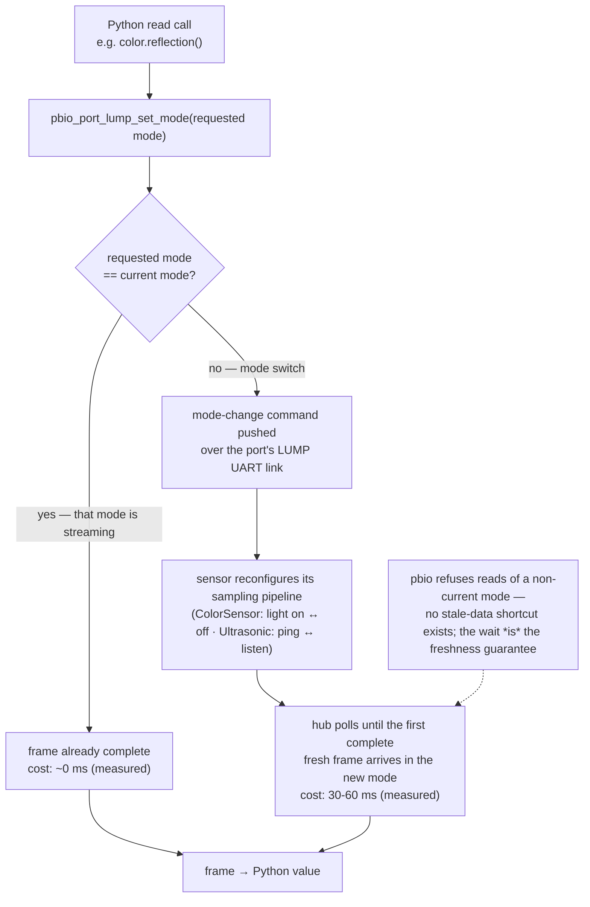
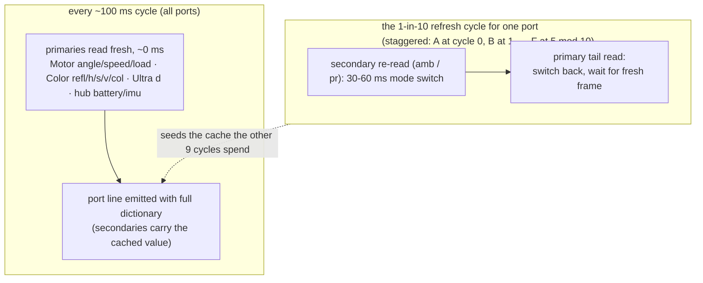
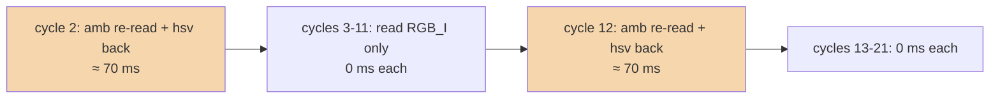

## D9 — Per-field freshness under PUP mode-switch costs

**Status:** accepted (2026-10-02, issue #15); amended 2026-10-02 — added the mechanism diagrams and per-device mode table; no decision changed.

**Context:** The D7 wire contract requires `port` lines emitted unconditionally per ~10 Hz cycle with the full per-device field dictionary. On-hub measurement (issue #15's first soak, 2026-10-02, with a Motor on A, ColorSensor on C, UltrasonicSensor on E) falsified the assumption that all reads are cheap: the cycle measured ~238 ms (4.2 Hz), and a per-op timing diagnostic isolated the cost entirely in Pybricks' PUP **mode switches** — every `pb_type_device_get_data` on a mode other than the device's current mode blocks ~30–60 ms waiting for fresh data in the new mode. Per read-pair, measured: ColorSensor `reflection()`/`hsv()`/`color()` read RGB_I and are instant when RGB_I is current, but `ambient()` (SHSV) costs ~34 ms and switches the mode, making the next `hsv()` (back to RGB_I) cost another ~33 ms; UltrasonicSensor `distance()` (DISTL) and `presence()` (LISTN) alternate modes at ~57+52 ms. Reads served from the device's current mode — including motor/battery/imu reads and the empty-port construct-ladder probe — measured 0 ms. The mode tables, verified against the v4.0.1 source (`pb_type_pupdevices_*.c`): Motor/ForceSensor/TiltSensor/InfraredSensor expose all their D7 fields from a single mode (no cross-mode cost); ColorSensor's only cross-mode field is `amb` (SHSV); UltrasonicSensor's is `pr` (LISTN); ColorDistanceSensor's are `d` (PROX) and `amb` (AMBI). With the full kit attached, the four unavoidable mode switches per cycle sum to ~176 ms — 10 Hz with all fields fresh is physically impossible on this hardware, and the choice is between relaxing cadence, dropping fields, or relaxing freshness.

**Mechanism** *(why a cross-mode read costs 30–60 ms, from the v4.0.1 pbio source)*: a PUP sensor is a small microcontroller connected to the hub over a LEGO UART (LUMP) link. At any moment the device is configured for exactly **one mode** and continuously streams data frames for that mode. Every Python read method (`pb_type_device_method_call`, `pybricks/common/pb_type_device.c`) first calls `pbio_port_lump_set_mode(requested)` — a no-op that returns success when the requested mode is already the current one (`port_lump.c`: "Mode already set or being set, so return success") — then waits for the current frame to be complete. A same-mode read finds data already streaming and returns in ~0 ms; a cross-mode read must push a mode-change command over the UART, and the device reconfigures its sampling pipeline before the first complete fresh frame in the new mode arrives — measured 30–60 ms of polling `pbio_port_lump_is_ready()`. There is no stale-read shortcut: `pbio_port_lump_get_data()` refuses data for a non-current mode (`INVALID_OP`), so the wait is also what *guarantees* the returned value is fresh in the requested mode. The mode is a physical operating configuration, not just a data selector — ColorSensor's RGB_I keeps its light **on** (surface reflection) while SHSV keeps it **off** (ambient light); UltrasonicSensor's DISTL actively pings for distance while LISTN passively listens for *other* sensors' pings (presence).

Per-device mode table (fields as D7 defines them; "one frame" = all listed fields travel in a single mode's frame):

| Device | Primary mode → fields | Secondary mode(s) → fields | What a switch physically does |
|---|---|---|---|
| Motor | one combined frame → `angle`, `speed`, `load` | — | n/a (single mode) |
| ForceSensor | FRAW → `f`, `d`, `pressed` | — | n/a (single mode) |
| TiltSensor | ANGLE → `pitch`, `roll` | — | n/a (single mode) |
| InfraredSensor | CAL → `d` | — | n/a (single mode) |
| ColorSensor | RGB_I (light on) → `refl`, `h`, `s`, `v`, `col` | SHSV (light off) → `amb` | toggles the sensor's illumination |
| UltrasonicSensor | DISTL (active ping) → `d` | LISTN (passive listen) → `pr` | transmitter off, receiver-only |
| ColorDistanceSensor | RGB_I → `refl`, `h`, `s`, `v`, `col` | PROX → `d`; AMBI → `amb` | illumination / measurement role |

**Decision:**

*Freshness classes.* Each per-device field is either **primary** (read every cycle from the device's default/main mode — 0 ms when the mode is current) or **secondary** (cross-mode; read on a sub-cadence with the last value cached between). Assignment: ColorSensor `refl`/`h`/`s`/`v`/`col` primary, `amb` secondary; UltrasonicSensor `d` primary, `pr` secondary; ColorDistanceSensor `refl`/`h`/`s`/`v`/`col` primary, `d` and `amb` secondary; Motor, ForceSensor, TiltSensor, InfraredSensor: all fields primary.

*Secondary refresh cadence.* Secondaries re-read every `SECONDARY_REFRESH = 10` cycles (~1 s at 10 Hz) — the same cadence class as `battery`. Refresh cycles are staggered by a per-port offset (port index in `A..F`, 0–5) so no single cycle pays more than one device's switch chain, spreading mode-switch cost evenly across the 1 s window.

*Cache seeding.* At discovery (construct time) each secondary field's cache is seeded with a real read — the one-time mode-switch chain is paid at attach, inside the construct-probe that already blocks. Consequence: the first emitted line after discovery carries fresh secondaries (no fake 0/`false` values on the wire), and existing byte-identity tests remain meaningful — the cache always holds a genuinely measured value.

*Read order inside a refresh cycle.* Secondaries first, then primaries: the refresh cycle ends on the primary mode, so the 9 non-refresh cycles pay zero switches. Within a refresh cycle the device performs exactly one extra chain (primary → secondary mode → back), same shape as the measured diagnostic.

Timeline of one port's 10-cycle window (ColorSensor on C, offset 2; per-cycle cost on the right):

*Wire unchanged.* Every D7 line keeps its full field dictionary and byte format; only the freshness of ≤2 fields per affected device is bounded to ~1 s. `port` lines stay unconditional per cycle. The parser/store/gateway need no change; a consumer can rely on: primaries reflect the cycle they were stamped in; secondaries reflect a value at most `SECONDARY_REFRESH` cycles old.

**Consequences:** The 10 Hz cadence for `port`/`imu` lines becomes achievable with real hardware attached (budget: ~100 ms cycle − ~0 ms primaries − amortized ~18 ms per-cycle secondary cost ≈ 80+ ms headroom). `amb`/`pr` (and ColorDistanceSensor's `d`/`amb`) lag ≤1 s — acceptable for ambient-light and presence displays, and honest: the alternative (all-fresh) measurably cannot hold 10 Hz. The stagger means per-cycle mode-switch cost is bounded by one device's chain, worst-case kit fully attached. On 51515 hardware (Motor/ColorSensor/UltrasonicSensor only), the steady-state per-cycle switch cost is 0 ms on non-refresh cycles of the two affected devices. Host-side tests assert the freshness contract via stub call-counting; on-hub cadence verification is the re-verification step for this change (next hardware session). If a future Pybricks release makes cross-mode reads cheap (e.g. mode-combination or faster settling), `SECONDARY_REFRESH = 1` collapses this decision back to all-fresh-per-cycle with no wire change.