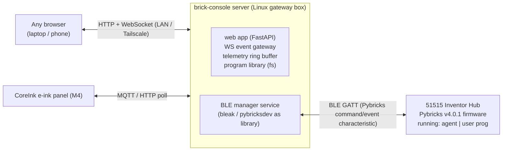
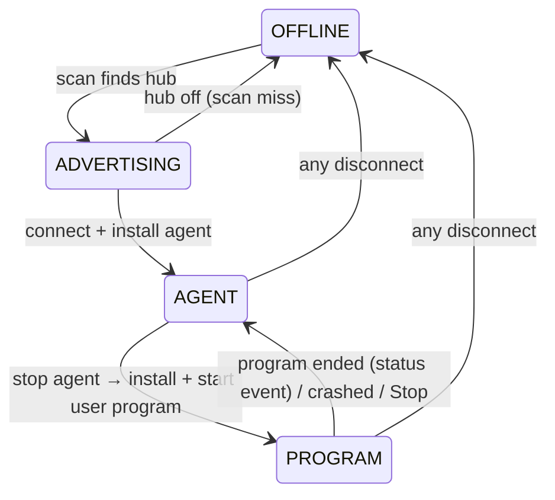

# Architecture — brick-console

Companion to [brd.md](brd.md). Covers components, protocols, the two-mode state model, and the data plane.

## 1. System context



## 2. Components (v1)

### 2.1 Server (Linux box)

| Component | Responsibility | Tech (planned) |
|---|---|---|
| **Web app** | Static dashboard + editor UI, REST endpoints, auth token check (M2+, optional per §6) | FastAPI + uvicorn |
| **WS gateway** | Push telemetry/log events to browsers; receive control commands | FastAPI WebSocket |
| **BLE manager** | Hub discovery, connection lifecycle, two-mode state machine, stdin/stdout/status pipes, run/stop — all hub access through the `Transport` seam (D6) | asyncio; `Transport` adapter over pybricksdev as a library + bleak |
| **Telemetry store** | Ring buffer (bounded deque) of parsed events; replay to late-joining clients | in-memory, collections.deque |
| **Program library** | `programs/*.py` on server fs, CRUD via REST | plain files |

### 2.2 Hub side (`brick_telemetry`)

A single importable MicroPython module distributed two ways:
- **Agent wrapper** — a ~10-line program, `agent/agent_main.py`, the server installs in RAM when idle (M1). It imports `brick_telemetry` and serves the idle dashboard. Wrapper and library must be co-located in `agent/` — pybricksdev's multi-file compile bundles imported modules from the script's own directory (`compile.py` resolves imports relative to the script's path).
- **User programs** — `import brick_telemetry` (opt-in) to keep the dashboard live while your program runs (M2+).

Library responsibilities: discover devices on ports (idempotent), read battery/IMU/motors/sensors on a tiered cadence, emit JSON lines to stdout, consume stdin commands (later: control).

Tiered cadence (from research — lego-control-center pattern):
- once on connect: `hub_info` (name, firmware, hub type)
- ~1 Hz: `battery` (voltage, current, %)
- ~10 Hz: `imu` (accel, gyro, orientation), `motor`/`sensor` states per port

### 2.3 Browser UI

Single-page app, no framework (vanilla + WebSocket client). Views:
- **Dashboard** — status chip (AGENT/PROGRAM/OFFLINE/EXTERNAL), battery card, port map with device chips, live values, IMU orientation widget
- **Console** — program editor (textarea→Monaco later) + stdout/stderr pane + Run/Stop
- **Control** (M3) — D-pad/sliders → stdin commands
- **Library** (M3) — program list, open/save/re-run

The status chip has four values; `EXTERNAL` is a UI overlay on OFFLINE — derived from the last disconnect reason ("external client took the hub", F6), it shows *why* the hub is offline, not a fifth server state.

**Mock mode (`?mock=1`):** the WS gateway serves synthetic events from a fake in-process event source (no BLE, no `Transport`, hub can be off) conforming to the telemetry schema (D7). Exists so the dashboard is developable and demoable with the hub off or the BLE link busy — the same schema, minus the radio.

## 3. Wire protocols

### 3.1 Hub ↔ server (BLE GATT)

The Pybricks firmware exposes (per [pybricks-ble-profile](https://github.com/pybricks/technical-info/blob/master/pybricks-ble-profile.md)):

| Characteristic | Use in brick-console |
|---|---|
| **Pybricks Command/Event char** (`c5f50002-…`) | All of it: install (WRITE_USER_PROGRAM_META → COMMAND_WRITE_USER_RAM chunks) + START/STOP_USER_PROGRAM; stdin writes (WRITE_STDIN, cmd 6); **stdout** (WRITE_STDOUT events, profile ≥ 1.3); status reports (STATUS_REPORT → program-running flag, program-end detection) |
| **Hub Capabilities char** (`c5f50003-…`) | max write size → chunk sizing |
| Nordic UART Service (Rx notify / Tx write) | Legacy stdio channel (pre-Pybricks-Profile-1.3 firmware only); unused on v4.0.1 |
| Device Information Service | Superseded by the `hub_info` telemetry event (§2.2); not accessed by the server |

Telemetry framing: **JSON lines over hub stdout** (decision D4) — on this firmware (Pybricks profile ≥ 1.3, v4.0.1) stdout arrives as `WRITE_STDOUT` events on the Pybricks command/event characteristic, *not* the Nordic UART Service (NUS is the legacy pre-1.3 channel; review finding 3). One JSON object per `print()`. E.g.:
```json
{"t": "battery", "v": 8085, "c": 42, "pct": 87}
{"t": "imu", "ax": 120, "ay": -980, "az": 0, "gx": 0, "gy": 0, "gz": 3}
{"t": "port", "p": "A", "dev": "Motor", "angle": 0, "speed": 0, "load": 0}
```

### 3.2 Browser ↔ server (WebSocket)

Server→browser event envelope:
```json
{"type": "telemetry", "hub": "Pybricks Hub", "data": {"t": "battery", ...}}
{"type": "log", "hub": "Pybricks Hub", "data": {"t": "stdout", "line": "..."}}
{"type": "state", "hub": "Pybricks Hub", "data": {"mode": "agent"}}
```

Browser→server commands: `{"type": "run", "program": "hello.py"}`, `{"type": "stop"}`, `{"type": "control", "btn": "fwd", "v": 80}` (M3), `{"type": "stdin", "line": "…"}`.

### 3.3 CoreInk ↔ server (M4)

Decision deferred to M4 (MQTT broker vs plain HTTP poll). Both ride the same telemetry ring buffer via a small publish shim. CoreInk constraints: no BLE under UiFlow2 (no PSRAM) → Arduino/NimBLE path for any direct-hub work, Wi-Fi client for the panel role.

## 4. State model (server-tracked) — the canonical one

The BRD §5 diagram is the *user-facing mode view* (hub-side: off/advertising/agent/program). This one is canonical for server behavior and issue text; where the two differ in naming, this wins (`AGENT MODE`→`AGENT`, etc.), and disconnect transitions are identical in both.



| State | Meaning | Dashboard shows |
|---|---|---|
| OFFLINE | Hub not seen; the service's bounded rescan loop (immediate, then backoff) running | "OFFLINE — scanning…" (EXTERNAL overlay if the last disconnect was an external client taking the hub, F6) |
| ADVERTISING | Hub advertisement detected; connect attempt in flight | "Connecting…" |
| AGENT | Connected; telemetry agent installed and running | Live values |
| PROGRAM | User program owns the hub | Console live; values stale-marked unless `brick_telemetry` imported |

Rules:
1. One BLE central at a time — if the server loses the hub to an external client, back off (~10 s rescan), never fight.
2. Program end (normal, crash, or Stop) is detected via the hub status event (`USER_PROGRAM_RUNNING` flag clearing — `Transport.subscribe_status`, review finding 1); the server then reinstalls the agent automatically.
3. Hub power-cycle → full reconnect path with fresh agent install; total time budget ≤ 5 s.
4. All state transitions logged with timestamps. A **session** = one connect→disconnect episode; **session history** = the timestamped transitions of such episodes.

## 4.5 BLE manager service (M1 concrete plan)

Runs as a systemd user service (`brick-console.service`, needs `loginctl enable-linger` for headless always-on), auto-started, auto-restarted. All hub access goes through the `Transport` seam (D6) — never bleak directly. Loop:

1. `await transport.discover("Pybricks Hub")` — scan by name only (the address drifts and is informational; AGENTS.md) — `asyncio.TimeoutError` ⇒ hub off ⇒ state=OFFLINE
2. `await transport.connect(discovered, on_disconnect=…)` — state=ADVERTISING → AGENT
3. `await transport.install_and_start(agent/agent_main.py)` — agent wrapper; then `await transport.subscribe_stdout(…)` (raw bytes → line splitter → JSON parser → ring buffer + WS broadcast) and `await transport.subscribe_status(…)` (program lifecycle edges)
4. On disconnect (callback): log reason, state=OFFLINE, bounded rescan loop — immediate, then backoff (~10 s ceiling, F6); the service's loop is sanctioned by AGENTS.md rule 5's exemption

## 5. Data retention

- Telemetry: bounded ring (default 5,000 events); CSV export endpoint reads it (R12).
- Program library: plain files under `programs/` — the only durable state.
- No DB in v1 (decision D5). If retention needs grow: SQLite at the server tier only.

## 6. Security posture

- Bind to LAN + Tailscale interface; never 0.0.0.0 exposure to the internet.
- Optional shared token header checked by FastAPI middleware (off by default, single-user LAN).
- The hub is unauthenticated by design (LEGO/Pybricks constraint) — acceptable because the hub is only reachable within BLE range of a physically secured box.

## 7. Repository layout (target)

```
brick-console/
├── docs/               # this doc set
│   ├── brd.md
│   ├── architecture.md
│   ├── decisions.md
│   ├── testing.md
│   └── research/       # investigation.md + brd-v0.1-draft.md (frozen archive), pybricksdev-api-notes.md (active library reference)
├── programs/           # user program library (server fs)
├── firmware/           # firmware zips + metadata (gitignored except README)
├── src/brick_console/  # server package (FastAPI + BLE manager over Transport)
├── agent/              # hub-side: brick_telemetry.py + agent_main.py wrapper (co-located for multi-file compile)
├── tests/              # pytest suite (hub-marked tests gated, testing.md)
├── hooks/              # uv-enforcement policy core wired into each coding agent
├── hello.py            # M0 bring-up artifact (BLE sanity program)
├── pyproject.toml
└── uv.lock
```

## 8. Technology choices (summary)

| Layer | Choice | Why |
|---|---|---|
| BLE | bleak 3.x primary; pybricksdev vendored GATT logic where it fits | bleak is the reference async BLE lib on Linux; pybricksdev proved the install/run flow at bring-up |
| Web | FastAPI + uvicorn | async-native (pairs with bleak), WS support, typed |
| Hub runtime | Pybricks v4.0.1 stable | flashed; reversible via DFU backup |
| Hub wire | JSON lines over hub stdout (Pybricks event characteristic on v4.0.1; NUS is legacy) | simplest debuggable channel (D4) |
| Frontend | vanilla JS + WS | zero build tooling for M1; upgrade path to a framework if needed |

See [decisions.md](decisions.md) for rationale records.