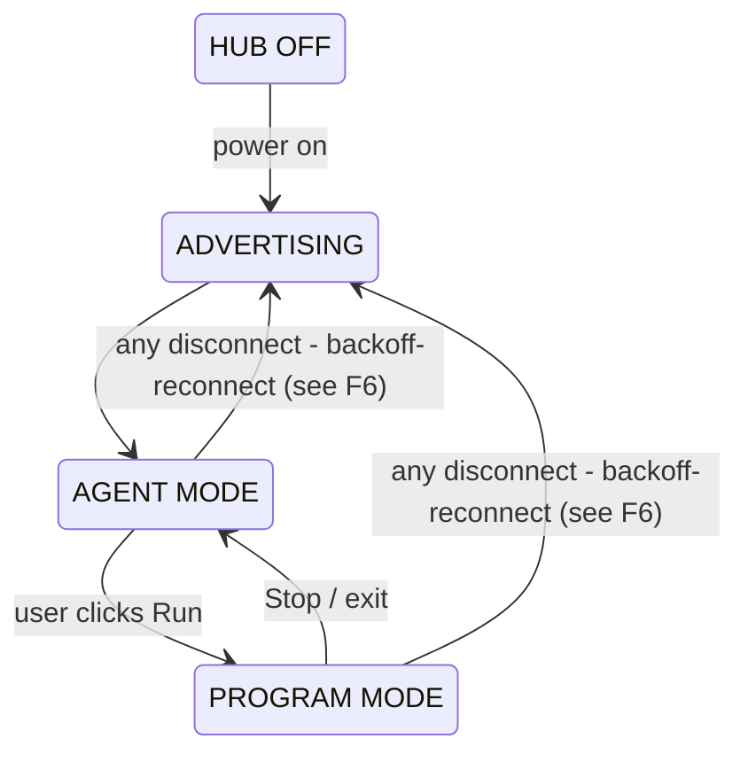

# BRD — brick-console

| | |
|---|---|
| **Product** | brick-console — self-hosted management console for the LEGO® MINDSTORMS® Robot Inventor 51515 hub |
| **Status** | v0.2 — active development (M1) |
| **Docs map** | [architecture.md](architecture.md) · [decisions.md](decisions.md) · [research archive](research/investigation.md) · [original draft](research/brd-v0.1-draft.md) |

## 1. Problem statement

The official LEGO Mindstorms Robot Inventor app retires **2026-10-01**. Its retirement leaves the 51515 hub with no supported first-party tool for programming, dashboarding, or management. The community's answer for firmware and programming is Pybricks — but Pybricks' tools are browser-side (Web Bluetooth) and single-session. After retirement there will be no always-on way to manage the hub from a machine without its own Bluetooth radio, and no dashboard that survives laptop reboots or hub power-cycles.

**brick-console closes that gap:** a self-hosted web application that turns the Linux gateway box into a persistent, always-on hub gateway.

## 2. Product vision

A single-user, self-hosted console running on the Linux gateway box (single-board AMD desktop, on the LAN/Tailscale). The box holds **the one BLE connection** to the hub; any browser on the network gets:

- a **live dashboard** — battery, ports, sensors, IMU, program state — without any Bluetooth hardware of its own;
- a **program console** — write, install, run, stop Python programs over the air, with live stdout/stderr;
- **persistence beyond a laptop session** — auto-reconnect, telemetry history, program library.

The North Star: *power on the hub anywhere in range; the dashboard is already alive when you open it.*

## 3. Users

Single user (the builder). Two usage modes:
- **Builder at a browser (laptop/phone):** writes/runs programs, watches telemetry, drives the robot remotely.
- **Robot at the desk:** hub powered on at any time; expects zero-ritual reconnection — no pairing, no "open the app".

## 4. Goals / non-goals

**Goals (v1)**
1. Replace the LEGO app's hub-management surface: dashboard, program install/run, console, library.
2. Zero-BLE browser experience on LAN/Tailscale.
3. Always-on: auto-discover, auto-connect, auto-recover — unattended.
4. Extensible data plane so the M5Stack CoreInk e-ink panel can join later without redesign.

**Non-goals (v1)**
- Word-blocks coding (Pybricks Code already serves that need).
- Firmware flashing from the web UI (one-time USB DFU, done manually — see [decisions.md](decisions.md) D-FL).
- Multi-user auth (single-user; LAN/Tailscale binding + optional shared token).
- Hubs other than 51515/PrimeHub class (architecture does not preclude it).

## 5. Concept of operations — two-mode state model

Pybricks runs **one user program at a time**, and its firmware exposes no ambient telemetry (see decisions D1). The product is therefore organized around an explicit mode switch, always reflected in the UI:

- **Agent mode (idle).** The server keeps a small telemetry agent installed in hub RAM — a thin wrapper around the `brick_telemetry` library. It never occupies the 5 permanent slots. Pushes: hub info (once), battery ~1 Hz, IMU + port/sensor/motor states ~10 Hz, as JSON lines over stdout (BLE NUS). Dashboard fully live.
- **Program mode.** The user's program owns the hub. Console streams its stdout/stderr. Full telemetry persists **only if the user program imports `brick_telemetry`** (opt-in); otherwise dashboard values freeze and are marked stale.
- Transitions are server-initiated, one click each way. No REPL polling — it interrupts running programs.

## 6. User flows

**F0 — Bring-up** (one-time; ✅ done 2026-09-24, see research archive)
Hub flashed with Pybricks v4.0.1 over USB DFU; original LEGO firmware backed up (`~/hermes/m5stack/backups/lego-original-inventor-hub.bin`, md5 `d0c76999…`); BLE hello-world run from the box succeeded. Recovery: DFU mode + `pybricksdev dfu restore <file>`.

**F1 — Open dashboard (daily path).** Hub powered on in BLE range → server auto-connects within seconds, installs + starts agent → open `http://<box>:<port>` on any LAN browser → live cards: battery %, port map + detected devices, live values, IMU orientation, status chip (AGENT / PROGRAM / OFFLINE).

**F2 — Write & run a program.** Editor pane over server-side program library → **Run**: agent stops → program compiled + downloaded to hub RAM → started → stdout/stderr streams to console pane → **Stop**: program stopped → agent re-installed → dashboard live again. Crashes surface tracebacks; hub stays connected; re-run is one click.

**F3 — Remote control.** Control tab (on-screen D-pad/sliders; Gamepad API later) → commands browser→WS→server→stdin of the user's control program (official Pybricks `pc-communication` pattern). Last-one-wins semantics, throttled (~20–50 ms/write).

**F4 — Program library.** Programs saved on server filesystem (`programs/*.py`), listed in UI, one-click re-run. Stretch: write to the hub's 5 permanent slots (blocked on Q2 — see open questions).

**F5 — CoreInk e-ink panel (later).** CoreInk (Arduino, Wi-Fi) subscribes to server telemetry (MQTT or HTTP poll); displays battery/ports/active program; ≥15 s refresh discipline.

**F6 — Conflict handling.** BLE allows one central. If the official Pybricks Code IDE connects, the server backs off (rescan every ~10 s), UI shows "external client took the hub", and reconnects when freed. Never fights over the hub.

## 7. Functional requirements (MoSCoW)

| # | Requirement | Prio |
|---|---|---|
| R1 | Auto-discover/auto-connect known hubs on power-up; status visible; auto-reconnect after power-cycle or external-client release | **Must** |
| R2 | Agent-mode dashboard: battery, port map + device types, live motor/sensor values, IMU | **Must** |
| R3 | Browser editor + install/run/stop over BLE + live stdout/stderr console | **Must** |
| R4 | Server-side program library (CRUD files) with one-click run | **Must** |
| R5 | Two-mode state model enforced in UI; frozen values marked stale unless the running program imports `brick_telemetry` | **Must** |
| R6 | On-screen remote-control panel → stdin command channel | Should |
| R7 | Telemetry ring buffer + simple graphs (battery over time, sensor traces) | Should |
| R8 | Control via browser Gamepad API (Xbox controller) | Could |
| R9 | Hub slot management (write permanent slots, slot picker) | Could (blocked on Q2) |
| R10 | Multi-hub support (~7–8 BLE connections/adapter ceiling) | Could |
| R11 | CoreInk e-ink status client | Could (M4) |
| R12 | Data-log export (CSV of telemetry buffer) | Could |
| R13 | Firmware flash via web UI | Won't (v1) |
| R14 | Word-blocks coding | Won't (v1) |
| R15 | Multi-user/auth | Won't (v1) |

## 8. Non-functional requirements

| Dimension | Target |
|---|---|
| Latency | Telemetry end-to-end ≤ 250 ms @ 10 Hz; control command ≤ 150 ms |
| Range | Hub within ~10 m of the box's BLE adapter (RSSI at bring-up: −45 dBm — strong) |
| Availability | Hobby-grade; stateless reconnect mandatory (R1); no DB in v1 — files + in-memory buffers |
| Security | Bind to LAN/Tailscale interfaces only, never public; optional shared token |
| Capacity | 1 hub by design; ≤ 4 concurrent hubs realistic per adapter |
| Observability | Server logs all BLE events (connect/disconnect/mode switches); UI shows session history |

## 8b. Open questions

| # | Question | Resolution plan |
|---|---|---|
| Q1 | ~~Does pybricksdev's *library* API expose all flows need (scan-by-name, download+run, stop, stdin/stdout streams)?~~ **Answered (2026-09-24, issue #2): yes** — scan-by-name, connect, RAM download+start, stop, stdin, and stdout are all library-level; the only gap is reconnect (build a fresh hub object per connection). Full reference with signatures: [docs/research/pybricksdev-api-notes.md](research/pybricksdev-api-notes.md). Interface pinned as `Transport` (D6). | Done |
| Q2 | Can a program be written to one of the hub's 5 permanent slots programmatically (not just run-to-RAM)? | Check Pybricks 4 firmware/docs + pybricks-code's slot behavior; unblocks R9 |
| Q3 | Is the box's USB BLE adapter reliable for long-lived connections? | Soak test during M1: hours-long connection, watch BlueZ disconnects |
| Q4 | BLE write throughput at 10 Hz telemetry + control commands — is NUS stdout the right wire, or does AppData GATT notify perform better? | Measure in M1 spike; AppData swap is designed-in (D4) |

(Q1 was already partially answered in practice: the hello-world used pybricksdev's own BLE stack successfully, but the library-level API for our server still needed the harness. Q4 is promoted from a footnote to a tracked question.)

## 9. Release milestones

| M | Scope | Exit criteria |
|---|---|---|
| M0 Bring-up ✅ | Flash, backup, env, BLE hello-world | Done 2026-09-24 (see F0) |
| **M1 Read-only dashboard** | BLE manager service + `brick_telemetry` agent + WS gateway + minimal web page | From laptop: live battery/ports/sensors ≤ 5 s after hub power-on |
| M2 Run & console | Editor pane, install/run/stop, live console | F2 end-to-end; crash→traceback; one-click back to agent mode |
| M3 Control & library | On-screen remote, stdin channel, program library CRUD | F3+F4 working; last-one-wins under rapid input |
| M4 CoreInk panel | Telemetry publish (MQTT/HTTP), CoreInk Arduino client | E-ink shows hub state; ≥15 s refresh |
| M5 Polish | Graphs, gamepad, slots (Q2), CSV export | Could-tier backlog |

## 10. Success metrics

v1 succeeds when: the dashboard opens live on the laptop with zero manual steps (R1+R2), a program round-trips F2 with visible output, and the hub survives a power-cycle without any laptop-side intervention. Everything else is garnish.

## 11. Out of scope / future themes

- Multi-hub fleet management (R10) beyond the adapter ceiling
- Firmware management UI (R13) — keep DFU manual
- Model/asset libraries, building instructions browser — not our problem
- Public multi-user SaaS — never (single-user tool)

## 12. Revision history

| Version | Date | Change |
|---|---|---|
| v0.1 | 2026-09-23 | First draft (research phase, pre-repo) |
| v0.2 | 2026-09-24 | Restructured for brick-console repo: split into docs set; hubdock→brick-console rename; F0 marked done; Q4 added; M0 exit recorded |